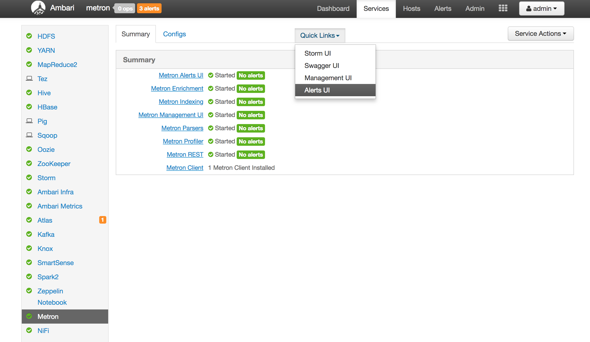



# Getting started with Metron
## Objectives
After this lab you will be able to:

1. Have your browser connect to the right domain for your metron instance.
2. Describe the main UIs for Metron.
3. Describe the information contained in each UI.
4. Open the UI and view the content.

## Setting up a host entry for easy course navigation

### For Linux/Unix/OSX

Edit your `hosts` file and add a entry to your AWS instance. First find your host IP adress that was provided to you. On your laptop do:

1. `sudo vi /etc/hosts`
2. Add `host_ip mobius.local`, where you replace *host_ip* with the real IP and save the file. 
3. You should now be able to access Ambari at http://mobius.local:8080/

### For Windows

For Windows 10 and 8:

1. Press the Windows key.
2. Type Notepad in the search field.
3. In the search results, right-click Notepad and select Run as administrator.
4. From Notepad, open the following file: c:\Windows\System32\Drivers\etc\hosts
5. Add `*host ip* mobius.local`, where you replace *host ip* with the real IP and save the file. 
7. Click File > Save to save your changes.
8. You should now be able to access Ambari at http://mobius.local:8080/

## Opening the Metron Management UI

 1. The management UI shows the sensors configured in Metron and their operational state (running/stopped and latency).  From the management UI you can create new sensors, view sensor configuration, browse raw logs sent by the sensor, and change the configuration of sensors.
 2. Open your browser to http://mobius.local:4200/ where *metron_host_name* is the name of the host provided to you in the workshop materials.
 3. When prompted for the password enter metron for the user and metron for the password.  
 
 4. The Metron Management UI opens showing the sensors configured in Metron and their operational state (running/stopped and latency).
   
   
## Opening the Metron Alerts UI
 1. The Metron Alerts UI shows enriched and triaged events stored in the Metron index.  From the Alerts UI, you can filter events, view event fields, and sort events.  You can also escalate, add comments to, or group events. 
 6. Open your browser to http://mobius.local:4201/.
 7. When prompted for the password enter metron for the user and metron for the password.  
 
 8. The Metron Alerts UI opens listing the events reported to Metron.  From the alerts UI you can search, filter and view the details of alerts. 
   
9. Consult the [Viewing Alerts User Guide](https://docs.hortonworks.com/HDPDocuments/HCP1/HCP-1.5.0/bk_user-guide/content/displaying_alerts.html) for more information on how to use the Alerts UI.
## Opening the Ambari UI
 1. Open Ambari to view the status of the Metron infrastructure and start, stop, and restart services.  Ambari also configures, installs and upgrades Metron software.
 2. Open your browser to http://mobius.local:8080/.
 3. When prompted for the password enter admin for the user and admin for the password.
 4. The Ambari management pages open.
   
5. The Quicklinks Ambari menu item launches the UIs for a service.   For example, select the M Management UI and Alerts UI  by selecting Services from the upper right and then Metron from the left.  Pull down quick links and select Management UI or Alerts UI to launch the Metron UIs.

## Single Node Metron Instance Quick Reference
For the workshop you will be provided with a single node version Metron installation.  

|Credential| Value |
|--|--|
|Metron Host Name  | Provided to you  |
|Metron Management UI|http://mobius.local:4200|
|Metron Alerts UI|http://mobius.local:4201|
|Metron Mgmt/Alerts Credentials|metron:metron|
|Ambari URL|http://mobius.local:8080|
|Ambari credentials|admin:admin|
|SSH key| Provided to you|
|Ssh| ssh -i *ssh_key.pem* centos@*metron_host_name*
|mysql console|mysql -u *user_name* -p|
|mysqldb root|root:|
|mysqldb metron|metron:Myp@ssw0rd |
|mysqldb metron password|Myp@ssw0rd|
|zoomdata url|http://mobius.local:6430|
|zoomdata credentials|admin:Metron1234!|

## Next Lab
[Parsing squid logs.](../02_ParsingSquid/README.md)
