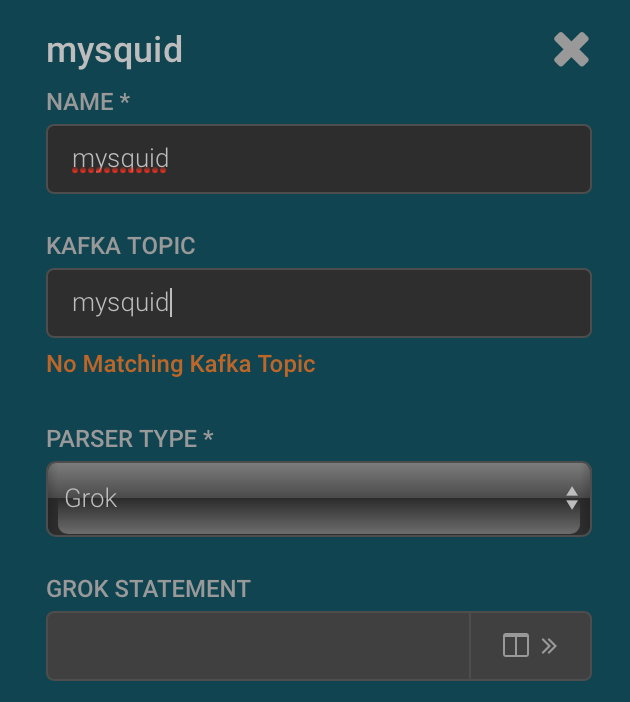
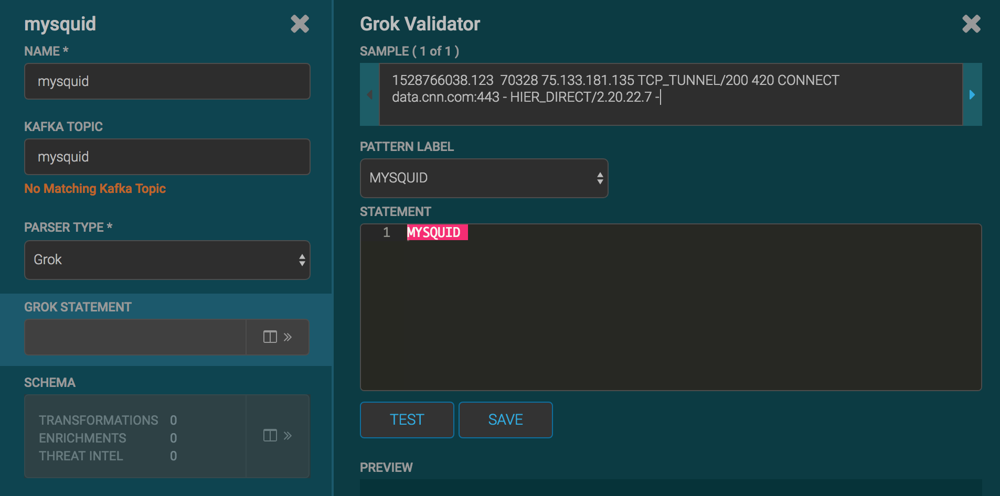
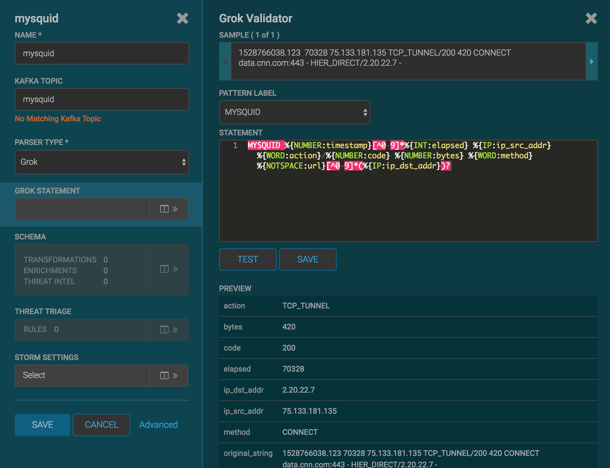
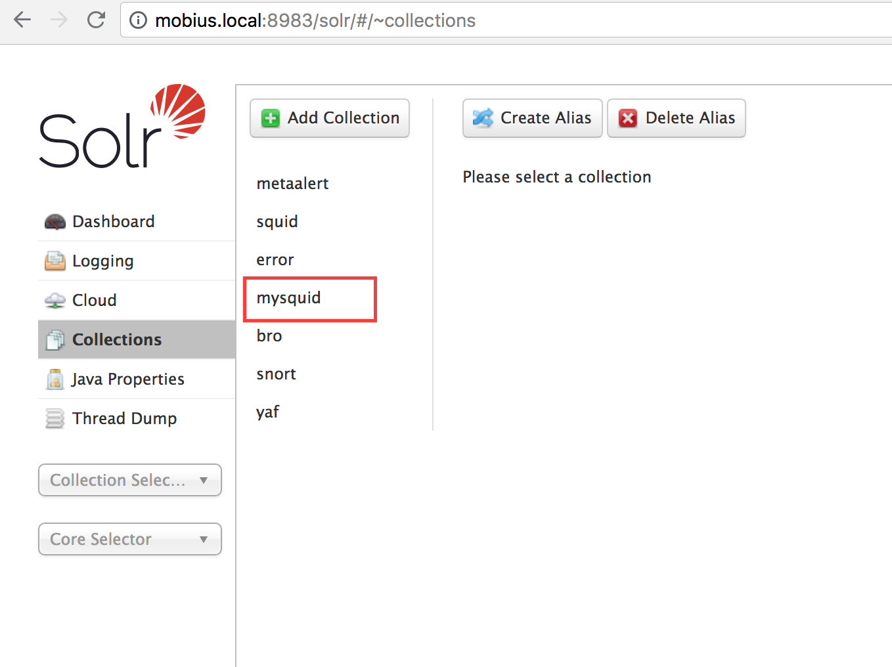
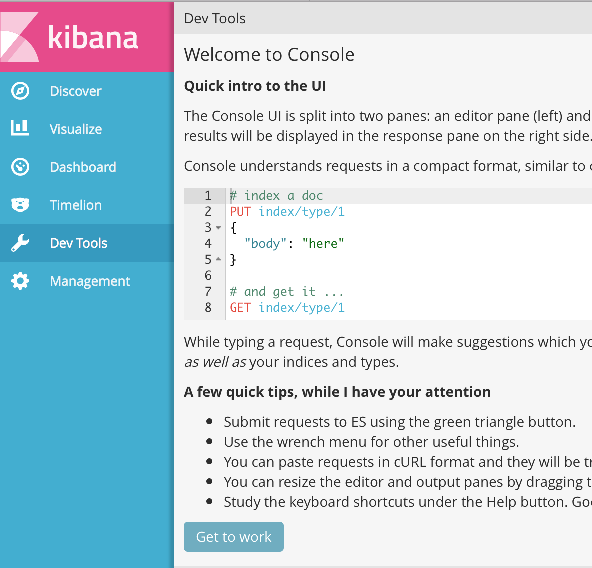
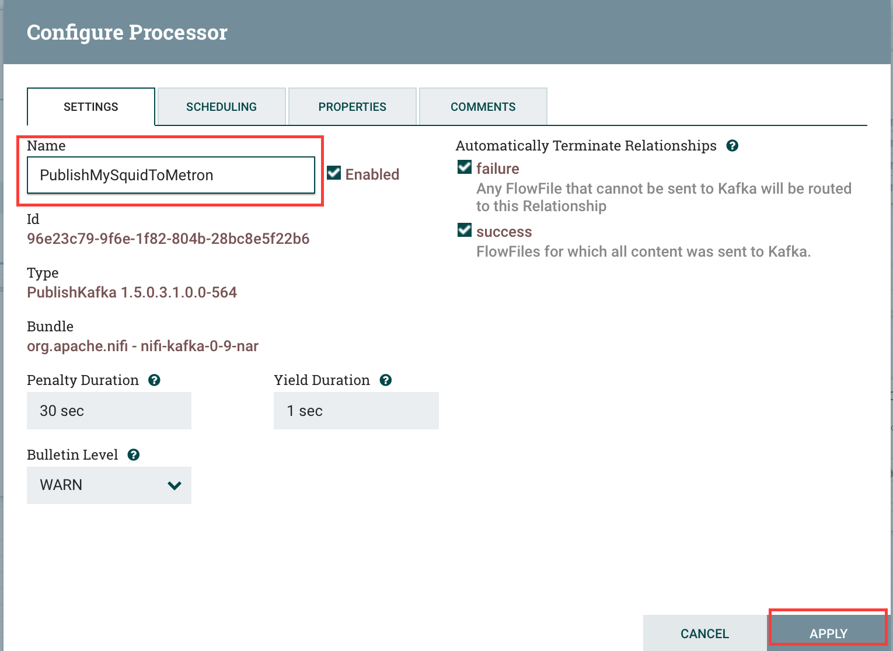
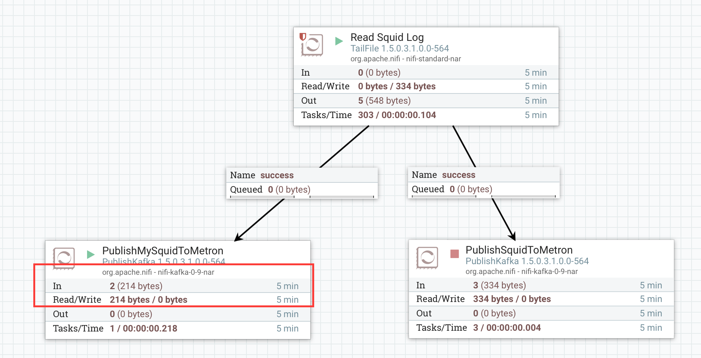
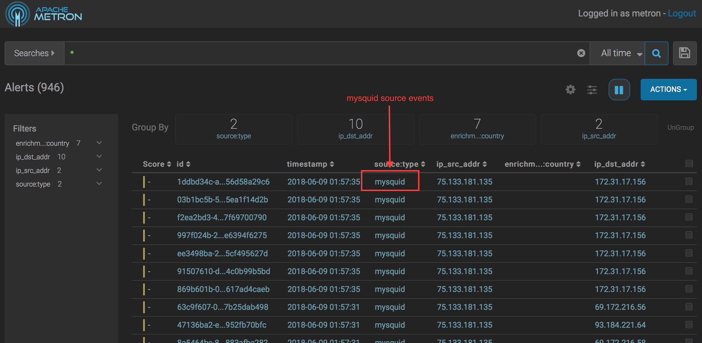

# Parsing Squid logs
## Objectives
After this lab you will be able to:
 1. Collect a squid proxy log and move it to Kafka using Nifi.
 2. Create a Metron squid parser.
 3. Add some simple transformations to the events.
 4. View the parsed logs in the Metron Alerts UI.
## Generate Squid Access Events
1. Your Metron host comes with a squid proxy installed.   Configure your proxy settings to use your squid proxy.  If you are not able to change your proxy settings, skip this step and use curl commands to generate traffic.  

### Chrome Proxy

The easiest way to control your proxy from Chrome is to install and extension such as Proxy SwitchySharp.  An extension enables you to select a menu item in Chrome to switch between your regular settings and your Metron proxy easily.   

On Mac open Chrome and select Chrome > Preferences from the main menu.  Scroll to the bottom of the settings page and click the Show advanced settings link.  Locate the Network section and click the Change proxy settings button. Check Web Proxy (HTTP) and enter `mobius.local` and the squid port 3128.  Check Secure Web Proxy (HTTPS) and enter your Metron name and the squid port 3128.  Click the OK button and then the Apply button to save your changes. 

### OSX Safari Proxy
On OSX go to System Preferences > Network > Wi-Fi. Click the Advanced button. Select the Proxies Tab, and check the Web Proxy (HTTP) and enter `mobius.local` and the squid port 3128.

### Windows Proxy

On Windows, follow the manual instructions on [this page](http://www.dummies.com/computers/operating-systems/windows-10/how-to-set-up-a-proxy-in-windows-10/)

2. In the browser configured with the Metron squid proxy, open a web site that generates web requests such as google.com or a news website.  

To generate data using curl, open a command line tool and enter:
```
curl -I --proxy mobius.local:3128 *web_url*
```
 
For example to access google using a proxy, 
```
curl -I --proxy mobius.local:3128 http://google.com
```

3. Open the Metron alerts ui by entering http://mobius.local:4201 in the browser. 

By default you will see the most recent events at the top of the UI.  At this point you should see some squid events with recent timestamps in the alerts ui.


If you click in the space between the columns, the full details of the event will open on the right side of the browser.


## Adding the  mysquid sensor
Now we will build a mysquid sensor from scratch using a grok parser. 
1. Open the Metron Management UI.
2. Click on the + button on the lower right corner to add a new sensor.
3. Enter the following:
```
	Name: mysquid
	Kafka Topic: mysquid
	Parser Type: Grok
```
Don't worry if you see the "No Matching Kafka Topic", the Kafka Topic will be created automatically on save.  


4. Click to expand the Grok Statement.  Paste the sample squid raw log entry below into the Sample field. 

```
1528766038.123  70328 75.133.181.135 TCP_TUNNEL/200 420 CONNECT data.cnn.com:443 - HIER_DIRECT/2.20.22.7 -
```



5. Copy and paste the grok expression below to the right of the MYSQUID grok expression name:

```
%{NUMBER:timestamp}[^0-9]*%{INT:elapsed} %{IP:ip_src_addr} %{WORD:action}/%{NUMBER:code} %{NUMBER:bytes} %{WORD:method} %{NOTSPACE:url}[^0-9]*(%{IP:ip_dst_addr})?
```

6. Press the Test button. The Preview section will update with the fields parsed from the raw log.  If there is an error and the preview does not appear, verify the sample and grok expression field values.   Adjust the sample or grok expression field values so the preview appears.



7. Click Save.
8. Verify that sensor name and topic name are "mysquid" with NO extra spaces or special characters.  
9. Click Save on the mysquid sensor.
10. The mysquid sensor appears in the management UI.  Click on the pencil icon to edit the mysquid sensor.  The mysquid configuration opens.
11. Scroll down to the Parser Config section.   
12.  In the enter field point, enter timestampField.
13. In enter value, enter timestamp.


14. Click the Save button.
## Installing the mysquid index template
After events are enriched and triaged, metron stores the events in an index.  The index template specifies how to interpret the metron events and how to index strings using either a keyword or full text search.  

Determine the index you are using (Solr or Elastic Search) and follow the instrutions in the corresponding section below.

### Creating a Collection in Solr
1. SSH into the metron host.   If you are logging in from windows, ssh using putty.

```
ssh -i <pem file> centos@mobius.local
```
2. Run the create_solr_collection command to create a new collection and install the collection schema.  The schema defines the types and search capabilities of each field in the events stored in the index.  

```
./create_solr_collection.sh mysquid
``` 
3. To see the definition of the schema use the more command on the metron host.  Press enter to advance one line.  Press space to advance one page.  To exit the more command enter 'q':

```
more /usr/hcp/current/metron/config/schema/mysquid/schema.xml
``` 

4. The solrconfig.xml file defines the configuration of the index.  The solr config does not vary by the index content.  When creating a new index, use the metron solrconfig.xml as is.

```
more /usr/hcp/current/metron/config/schema/mysquid/solrconfig.xml
``` 

5. In the browser, open solr collections interface to see the mysquid collection:
http://mobius.local:8983/solr/#/~collections
 



### Creating an index in Elastic Search
1. Enter the Kibana url in the browser:
http://mobius.local:5000
2. Select Dev Tools from the left hand side of the kibana page.  The Dev Tools console is an easy way to interact with the index REST api.  If the Welcome window appears, click the Get to work button.



3. Paste the following command into the left side of Dev Tools window:


```
PUT _template/mysquid 
{
    "template": "mysquid_index*",
    "settings": {},
    "mappings": {
      "mysquid_doc": {
        "dynamic_templates": [
          {
            "geo_location_point": {
              "match": "enrichments:geo:*:location_point",
              "match_mapping_type": "*",
              "mapping": {
                "type": "geo_point"
              }
            }
          },
          {
            "geo_country": {
              "match": "enrichments:geo:*:country",
              "match_mapping_type": "*",
              "mapping": {
                "type": "keyword"
              }
            }
          },
          {
            "geo_city": {
              "match": "enrichments:geo:*:city",
              "match_mapping_type": "*",
              "mapping": {
                "type": "keyword"
              }
            }
          },
          {
            "geo_location_id": {
              "match": "enrichments:geo:*:locID",
              "match_mapping_type": "*",
              "mapping": {
                "type": "keyword"
              }
            }
          },
          {
            "geo_dma_code": {
              "match": "enrichments:geo:*:dmaCode",
              "match_mapping_type": "*",
              "mapping": {
                "type": "keyword"
              }
            }
          },
          {
            "geo_postal_code": {
              "match": "enrichments:geo:*:postalCode",
              "match_mapping_type": "*",
              "mapping": {
                "type": "keyword"
              }
            }
          },
          {
            "geo_latitude": {
              "match": "enrichments:geo:*:latitude",
              "match_mapping_type": "*",
              "mapping": {
                "type": "float"
              }
            }
          },
          {
            "geo_longitude": {
              "match": "enrichments:geo:*:longitude",
              "match_mapping_type": "*",
              "mapping": {
                "type": "float"
              }
            }
          },
          {
            "timestamps": {
              "match": "*:ts",
              "match_mapping_type": "*",
              "mapping": {
                "type": "date",
                "format": "epoch_millis"
              }
            }
          },
          {
            "threat_triage_score": {
              "mapping": {
                "type": "float"
              },
              "match": "threat:triage:*score",
              "match_mapping_type": "*"
            }
          },
          {
            "threat_triage_reason": {
              "mapping": {
                "type": "text",
                "fielddata": "true"
              },
              "match": "threat:triage:rules:*:reason",
              "match_mapping_type": "*"
            }
          }
        ],
        "properties": {
          "action": {
            "type": "keyword"
          },
          "bytes": {
            "type": "long"
          },
          "code": {
            "type": "long"
          },
          "domain_without_subdomains": {
            "type": "keyword"
          },
          "elapsed": {
            "type": "long"
          },
          "full_hostname": {
            "type": "keyword"
          },
          "guid": {
            "type": "keyword"
          },
          "ip_dst_addr": {
            "type": "ip"
          },
          "ip_src_addr": {
            "type": "ip"
          },
          "is_alert": {
            "type": "keyword"
          },
          "is_potential_typosquat": {
            "type": "boolean"
          },
          "method": {
            "type": "keyword"
          },
          "original_text": {
            "type": "text"
          },
          "source:type": {
            "type": "keyword"
          },
          "timestamp": {
            "type": "date",
            "format": "epoch_millis"
          },
          "url": {
            "type": "keyword"
          },
          "alert": {
            "type": "nested"
          }
        }
      }
    }
  }
```

4. Press the green play button.   The result on the right hand side of the screen will show "acknowledged" : true
## Starting the mysquid sensor
1. Return to the Metron Management UI.
2. Push the play button on the mysquid sensor to start the parser.
## Moving squid access.log lines to Kafka for processing by Metron
1. Enter the Nifi URL in your browser:
 http://mobius.local:9090/nifi/
2. The Nifi flow on the canvas tails the squid access.log and sends the lines to the PublishKafka.  PublishKafka breaks the log sample into individual lines and writes each line as a Kafka message to the squid topic.


3. Right click on the PublishSquidToMetron processor and select Copy.

4. Right click on an empty area of the canvas and select Paste.  


5. Right click on the copy of PublishSquidToMetron and select Configure.

6. Click on the Settings tab and change the name to PublishMySquidToMetron.


7. Click the Properties tab and change Topic Name to mysquid.


8. Click Apply to save the changes.

9. Hover the cursor over the Read Squid Log processor until the connect icon appears.   Click and drag the flow to the middle of the PublishMySquidToMetron.  Drop the cursor and the Create Connection dialog appears.


10. Click Add and make sure you Start the processor by clicking Start in the Operate panel.

11. The flow should look as below:


12.  The flow can now write squid data to both topics or either topic.  It will be easier to see what is happening if we stop writing to the squid topic.   
13. Right click on PublishSquidToMetron and select Stop.
14. Right click on PublishMySquidToMetron and select Start.


15. Set the browser to use the Metron proxy to start data flowing to the mysquid topic.  Enter google or a news site URL or any other URL that creates web request traffic to the squid proxy. 
16. When log lines are flowing to the mysquid sensor, the In field of the PublishMySquidToMetron processor should be greater than zero. 



17. Open Metron Alerts UI.  In a few minutes the Metron Alerts UI show mysquid events. If you don't see event with mysquid source, go to the Metron Configuration UI, stop mysquid and start it again.  It might take a minute or two for events to start flowing.
 



18.  Congratulations!  You are now ingesting squid log events.  The next step is to add enrichments.

## Next Lab
[Enriching squid logs.](../03_EnrichingSquid/README.md)

## References

[Metron Run Book](https://docs.hortonworks.com/HDPDocuments/HCP1/HCP-1.6.1/runbook/cybersecurity-runbook.pdf)

[Metron Source Code](https://github.com/apache/metron)
