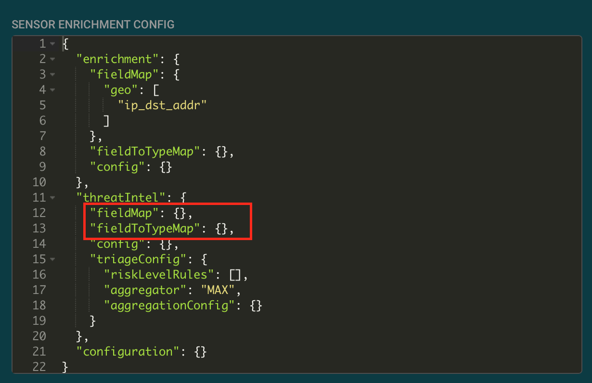
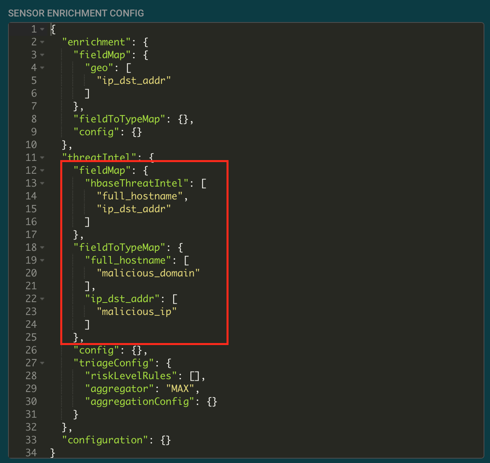
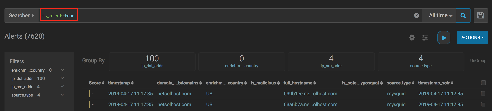
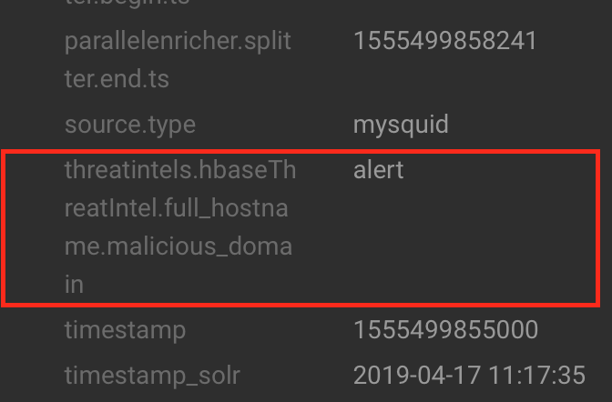

# Applying Threat Intelligence to Squid logs
## Objectives
After this lab you will be able to:
 1. Load threat intelligence stored in a file.
 2. Load threat intelligence through a streaming writer. 
 2. Apply threat intelligence to a field in an event. 

## Overview

Machine-Readable Threat Intelligence consists of a set of indicators of compromise in the current threat landscape.  For example, known malicious ip and domain names.  Metron automatically applies threat intelligence to fields of incoming events and sets the is_alert field to true if there is a match.  

## Loading malicious ip list threat intelligence from a file

1. Ssh into mobius.local.  Perform the following commands in the centos home directory.

2. Download the ip blocklist.

```
[centos@mobius ~]$ curl https://zeustracker.abuse.ch/blocklist.php?download=ipblocklist | grep -v "^#" | grep -v "^$" > malicious_ips.csv
  % Total    % Received % Xferd  Average Speed   Time    Time     Time  Current
                                 Dload  Upload   Total   Spent    Left  Speed
100  1999  100  1999    0     0  16618      0 --:--:-- --:--:-- --:--:-- 16658
```

3. Verify that the malicious_ips.csv file contains a list of ip addresses.

```
[centos@mobius ~]$ head malicious_ips.csv 
101.200.81.187
103.19.89.118
103.230.84.239
103.4.52.150
103.7.59.135
104.247.219.41
109.127.8.242
109.229.210.250
109.229.36.65
113.29.230.24
``` 

4. Open a new file called malicious_ip_extractor_config.json in a text editor such as vi.

```
vi malicious_ip_extractor_config.json 
```

5. Add extractor config file json below to the file and save it.  The extractor config specifies how Metron converts the columns of the CSV into name value pairs in HBase.  The type is the type of threat intelligence, i.e. malicious_host vs malicious_domain. 

```
{
    "config" : {
       "zk_quorum" : "localhost:2181"
       ,"columns" : {
           "ip" : 0
       }
       ,"indicator_column" : "ip"
       ,"type" : "malicious_ip"
       ,"separator" : ","
    }
    , "extractor" : "CSV"
}
```
 
6. Verify the extractor config file.

```
[centos@mobius ~]$ cat malicious_ip_extractor_config.json 
{
    "config" : {
       "zk_quorum" : "localhost:2181"
       ,"columns" : {
           "ip" : 0
       }
       ,"indicator_column" : "ip"
       ,"type" : "malicious_ip"
       ,"separator" : ","
    }
    , "extractor" : "CSV"
}
```

7. Use the flatfile_loader.sh to load the malicious ips into HBase.

```
/usr/hcp/current/metron/bin/flatfile_loader.sh -e malicious_ip_extractor_config.json -t threatintel -i malicious_ips.csv -c t 
```

8. Display a list of malicious_ips loaded into HBase. 

```
[centos@mobius ~]$ head malicious_ips.csv 
101.200.81.187
103.19.89.118
103.230.84.239
103.4.52.150
103.7.59.135
104.247.219.41
109.127.8.242
109.229.210.250
109.229.36.65
113.29.230.24
```

9. Choose one of the ip addresses loaded into threat intelligence.  Open the Stellar shell and enter the command, ENRICHMENT_GET command below.   The first parameter ('malicious_ip') is the type of the indictor specified in the extractor config file.   Enter a domain in the malicious_ips.csv file as the second parameter.  The last two parameters are the table and column family specified as parameters to the flatfile_loader.  The value returned from the Stellar command should be json with an ip attribute that is equal to the ip passed in.

```
[centos@mobius ~]$ /usr/hcp/current/metron/bin/stellar -z localhost:2181
SLF4J: Class path contains multiple SLF4J bindings.
SLF4J: Found binding in [jar:file:/usr/hcp/1.9.0.0-9/metron/lib/metron-profiler-repl-0.7.1.1.9.0.0-9.jar!/org/slf4j/impl/StaticLoggerBinder.class]
SLF4J: Found binding in [jar:file:/usr/hdp/2.6.5.1100-53/hadoop/lib/slf4j-log4j12-1.7.10.jar!/org/slf4j/impl/StaticLoggerBinder.class]
SLF4J: See http://www.slf4j.org/codes.html#multiple_bindings for an explanation.
SLF4J: Actual binding is of type [org.slf4j.impl.Log4jLoggerFactory]
Stellar, Go!
Functions are loading lazily in the background and will be unavailable until loaded fully.
{es.clustername=metron, es.ip=node1:9300, es.date.format=yyyy.MM.dd.HH, parser.error.topic=indexing, update.hbase.table=metron_update, update.hbase.cf=t, es.client.settings={}, solr.zookeeper=mobius.local.localdomain:2181/solr, profiler.client.period.duration=1, profiler.client.period.duration.units=MINUTES, user.settings.hbase.table=user_settings, user.settings.hbase.cf=cf, bootstrap.servers=mobius.local.localdomain:6667, source.type.field=source.type, threat.triage.score.field=threat.triage.score, enrichment.writer.batchSize=15, enrichment.writer.batchTimeout=0, profiler.writer.batchSize=15, profiler.writer.batchTimeout=0, geo.hdfs.file=/apps/metron/geo/1553998428743/GeoLite2-City.tar.gz, asn.hdfs.file=/apps/metron/asn/1553998428743/GeoLite2-ASN.tar.gz}
[Stellar]>>> ENRICHMENT_GET( 'malicious_ip', '101.200.81.187', 'threatintel', 't')
{ip=101.200.81.187}
[Stellar]>>> quit
```

## Loading malicious domain list threat intelligence from a stream 

1. Ssh into mobius.local.   Download a malicious domain list and store it in a CSV file.

```
[centos@mobius ~]$ curl https://zeustracker.abuse.ch/blocklist.php?download=domainblocklist | grep -v "^#" | grep -v "^$" | grep -v "^https" | awk '{print $1",abuse.ch"}' > malicious_domains.csv
  % Total    % Received % Xferd  Average Speed   Time    Time     Time  Current
                                 Dload  Upload   Total   Spent    Left  Speed
100  7295  100  7295    0     0  63476      0 --:--:-- --:--:-- --:--:-- 63991
```

2. Verify that the malicious domain list downloaded properly.

```
[centos@mobius ~]$ head malicious_domains.csv 
039b1ee.netsolhost.com,abuse.ch
03a6b7a.netsolhost.com,abuse.ch
03a6f57.netsolhost.com,abuse.ch
03bbec4.netsolhost.com,abuse.ch
0if1nl6.org,abuse.ch
0x.x.gg,abuse.ch
54g35546-5g6hbggffhb.tk,abuse.ch
76tguy6hh6tgftrt7tg.su,abuse.ch
afobal.cl,abuse.ch
ahmedashid.com,abuse.ch
```
 
3. In the Metron Config UI, create a new sensor by pressing the + icon on the lower right hand corner.
4. Set the Name field to malicious_domains. Set the Kafka Topic field to malicious_domains. Select Parser Type CSV.

5. Click Save.

6. Click on the malicious_domains sensor  pencil icon to open the sensor config.
7. Go to the Advanced section and click the >>> on Raw Json to expand the Json configs.

8. Set the parser config to the following JSON: 

```
{
    "parserClassName": "org.apache.metron.parsers.csv.CSVParser",
    "filterClassName": null,
    "sensorTopic": "malicious_domains",
    "outputTopic": null,
    "errorTopic": null,
    "writerClassName": "org.apache.metron.enrichment.writer.SimpleHbaseEnrichmentWriter",
    "errorWriterClassName": null,
    "readMetadata": false,
    "mergeMetadata": false,
    "numWorkers": null,
    "numAckers": null,
    "spoutParallelism": 1,
    "spoutNumTasks": 1,
    "parserParallelism": 1,
    "parserNumTasks": 1,
    "errorWriterParallelism": 1,
    "errorWriterNumTasks": 1,
    "spoutConfig": {},
    "securityProtocol": null,
    "stormConfig": {},
    "parserConfig": {
        "shew.table": "threatintel",
        "shew.cf": "t",
        "shew.keyColumns": "domain",
        "shew.enrichmentType": "malicious_domain",
        "columns": {
            "domain": 0,
            "source": 1
        }
    },
    "fieldTransformations": [],
    "cacheConfig": {},
    "rawMessageStrategy": "DEFAULT",
    "rawMessageStrategyConfig": {}
}
```

Note the writerClassName attribute in the malicious_domains sensor and HBase information in the parserConfig.   

11. Click Save below the Json configs.  Click Save on the Sensor config.

10. Click the stop button on all sensor EXCEPT mysquid.  This ensures the cluster will have enough resources to run the malicious_domains sensor.  Click the play button on the malicious_domain sensor to start the sensor.  

11. In the mobius.local console send some threat intelligence to the malicious_domain sensor.

```
[centos@mobius ~]$ head malicious_domains.csv | /usr/hdp/current/kafka-broker/bin/kafka-console-producer.sh --broker-list localhost:6667 --topic malicious_domains 
>>>>>>>>>>>
```

12. Verify that the threat intelligence loaded properly.

```
[centos@mobius ~]$ /usr/hcp/current/metron/bin/stellar -z localhost:2181
SLF4J: Class path contains multiple SLF4J bindings.
SLF4J: Found binding in [jar:file:/usr/hcp/1.9.0.0-9/metron/lib/metron-profiler-repl-0.7.1.1.9.0.0-9.jar!/org/slf4j/impl/StaticLoggerBinder.class]
SLF4J: Found binding in [jar:file:/usr/hdp/2.6.5.1100-53/hadoop/lib/slf4j-log4j12-1.7.10.jar!/org/slf4j/impl/StaticLoggerBinder.class]
SLF4J: See http://www.slf4j.org/codes.html#multiple_bindings for an explanation.
SLF4J: Actual binding is of type [org.slf4j.impl.Log4jLoggerFactory]
Stellar, Go!
Functions are loading lazily in the background and will be unavailable until loaded fully.
{es.clustername=metron, es.ip=node1:9300, es.date.format=yyyy.MM.dd.HH, parser.error.topic=indexing, update.hbase.table=metron_update, update.hbase.cf=t, es.client.settings={}, solr.zookeeper=mobius.local.localdomain:2181/solr, profiler.client.period.duration=1, profiler.client.period.duration.units=MINUTES, user.settings.hbase.table=user_settings, user.settings.hbase.cf=cf, bootstrap.servers=mobius.local.localdomain:6667, source.type.field=source.type, threat.triage.score.field=threat.triage.score, enrichment.writer.batchSize=15, enrichment.writer.batchTimeout=0, profiler.writer.batchSize=15, profiler.writer.batchTimeout=0, geo.hdfs.file=/apps/metron/geo/1553998428743/GeoLite2-City.tar.gz, asn.hdfs.file=/apps/metron/asn/1553998428743/GeoLite2-ASN.tar.gz}
[Stellar]>>> ENRICHMENT_GET( 'malicious_domain', '039b1ee.netsolhost.com', 'threatintel', 't')
{original_string=039b1ee.netsolhost.com,abuse.ch, guid=a7542547-13c3-474a-8205-f497ea82a8e4, source=abuse.ch, timestamp=1555497608044, source.type=malicious_domains}
[Stellar]>>> quit
```

## Applying malicious_domain and malicious_ip threat intelligence to squid events.

1. Open the Metron config ui.

2. Open the mysquid sensor and navigate to the Raw Json.

3. In the sensor enrichment config section replace the threat intelligence fieldMap and fieldToTypeMap with the text below:

```
"fieldMap": {
            "hbaseThreatIntel": [
                "full_hostname",
                "ip_dst_addr"
            ]
        },
        "fieldToTypeMap": {
            "full_hostname": [
                "malicious_domain"
            ],
            "ip_dst_addr": [
                "malicious_ip"
            ]
        },
```  





4. Generate some traffic that triggers the threat intelligence.

```
today=`date +'%s.000'`
head malicious_domains.csv | awk -v todays_date=$today 'BEGIN {FS =","} {print todays_date"  66025 208.54.147.129 TCP_TUNNEL/200 7699 CONNECT " $1 ":443 - HIER_DIRECT/72.21.206.140 -"}' | /usr/hdp/current/kafka-broker/bin/kafka-console-producer.sh --topic mysquid --broker-list localhost:6667
```

5. Open the Metron Alerts UI.  Enter is_alert:true in the search.  Click the search button.  There will be some alerts.



6. Click on the alert. Scroll down to the bottom of the alert details.  The threat intel causing the alert is indicated by the threatintels.hbaseThreatIntel.full_hostname.malicious_domain field.



