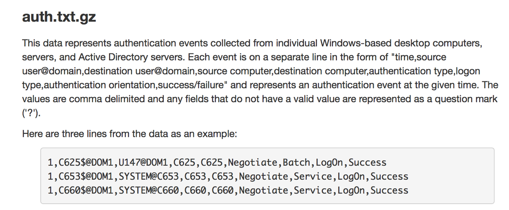
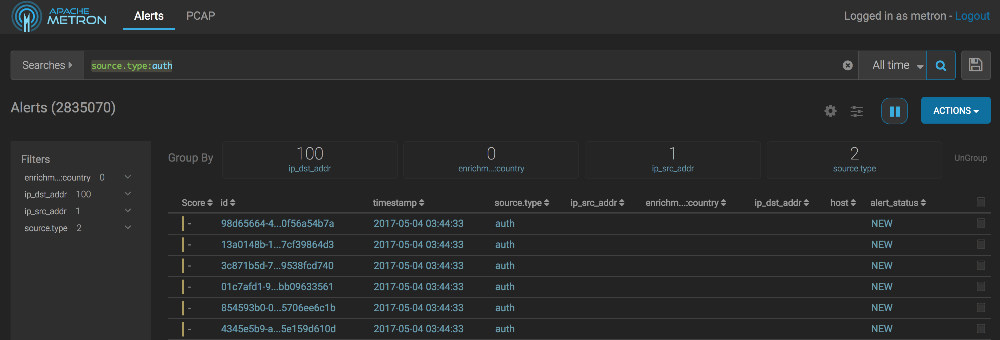
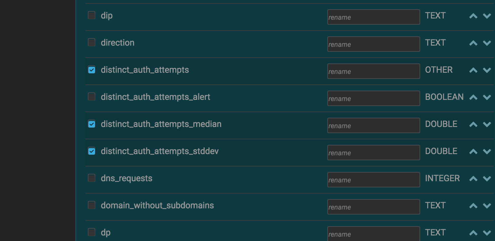
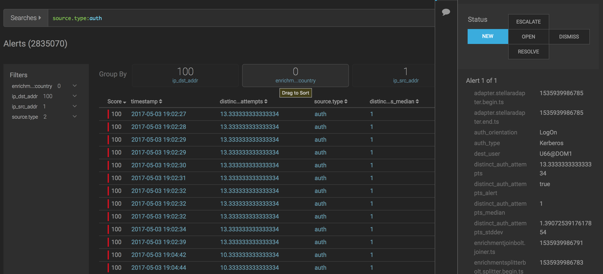
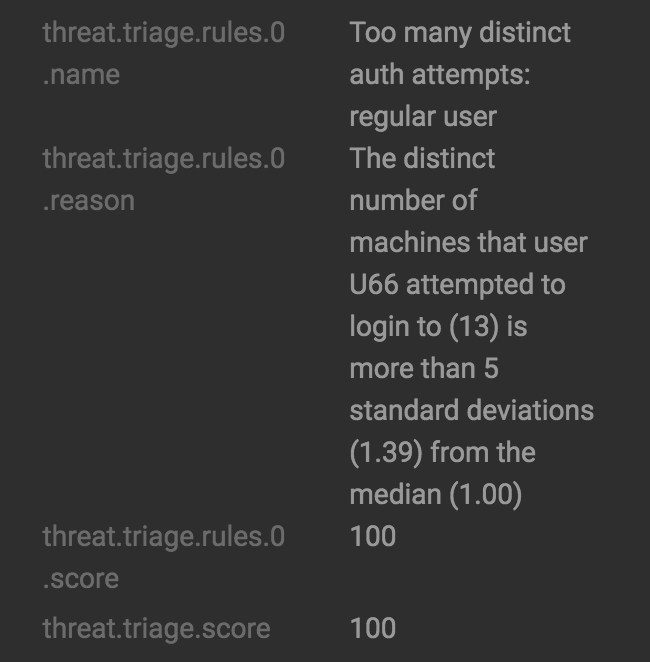
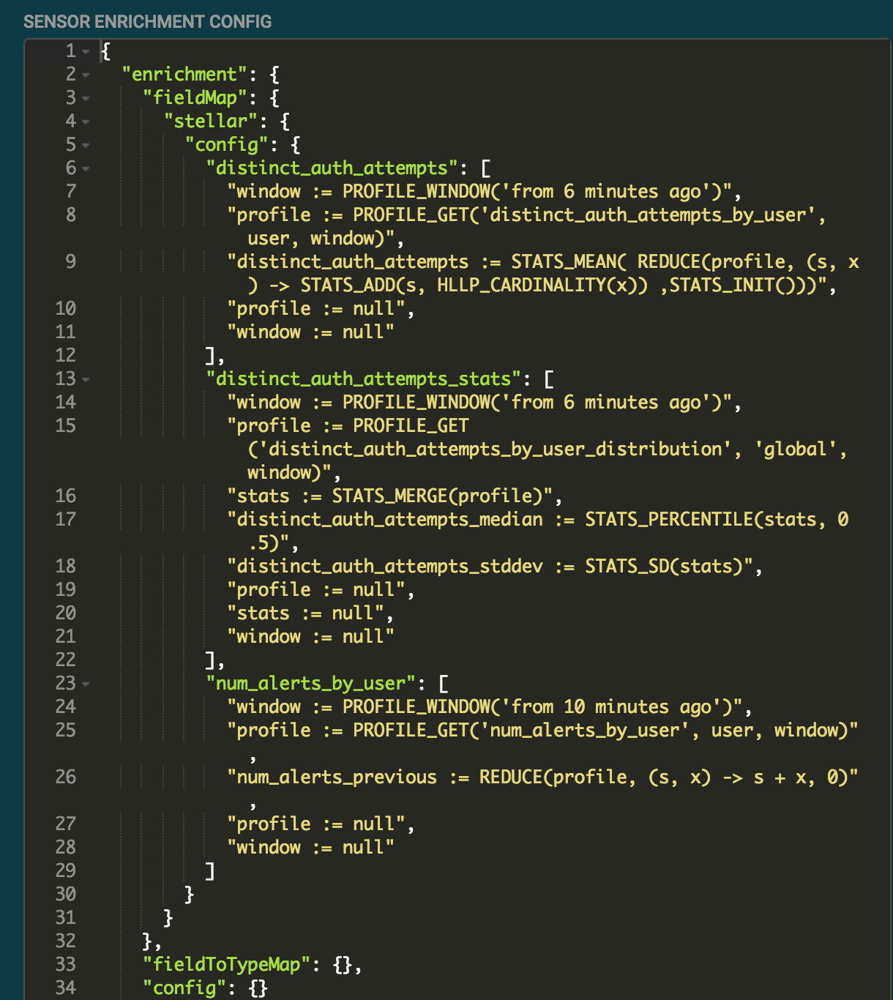
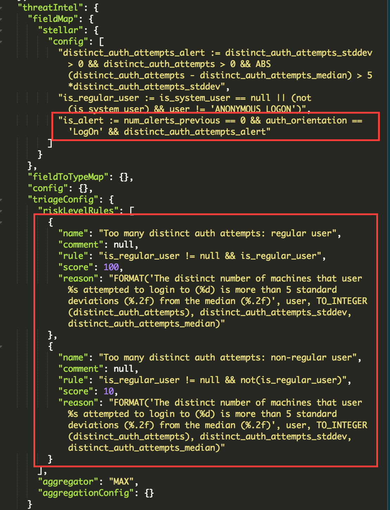

# User and Entity Behavior Analytics(UEBA) with User Authentication Event
## Objectives
After this lab you will be able to:
1. Describe the components of a Metron profile.
2. Explain how to detect anomalous logins and triage events using Metron profiles.
## Background
The Metron profiler collects time series measurements using high throughput algorithms to capture the behavior of an entity.  Metron profiles are flexible and use an extension language to define the measurement to capture.   Using statistics we can compare the measurements for an entity to the measurements for its peers.  If the behavior of the entity is significantly different from its peers, we can trigger an alert.

In this lab we will look at example profiles, the measurements captured by those profiles, and the alerts triggered by the profile triage rules.    

## Browse the LANL Auth data set in Metron Alerts UI

1. Let's take a look at the source authentication logs.  The log data is real authentication data containing breaches captured by the from Los Alamos National Labs during test activities :

http://csr.lanl.gov/data/cyber1/



2. Because it takes some time to ingest the large event data set, your Metron test instance is already populated with the triaged LANL auth events.  Open the metron alerts UI:

http://mobius.local:4201

Enter source.type:auth in the Searches field if using Solr or source:type:auth if using Elastic Search. Click the magnifying glass icon.  The alerts UI shows only auth alerts.



3. Click on the gear icon.  Uncheck all fields EXCEPT the following:
Score, Timestamp, source.type, distinct auth_attempts, distinct_auth_attempts_median, distinct_auth_attempts_stddev, and user.




4. Click Save.

5. The Alerts UI now shows the measurements derived from the profiles that determine if a user is logging into more hosts than other peer users. 


6. Click on the arrows to the right of the score to sort ascending by score.   Then click again to sort descending by score.  You should see red alerts scored 100 at the top.  Click in the whitespace between the columns to bring up the alert details.



7. Scroll to the triage section and read the description of the score.   For example: "The distinct number of machines that user U66 attempted to login to (13) is more than 5 standard deviations (1.39) from the median (1.00)"



8. Before ingesting the auth data, the following JSON profile config files were installed using the [zk_config_load_configs.sh PUSH command](https://docs.hortonworks.com/HDPDocuments/HCP1/HCP-1.6.1/runbook/content/creating_a_profile.html).  For each profile, the configuration specifies:
* profile: unique identifier of the profile
* foreach: peer group of the profile.  For example, one per entity or global or a peer group such as users in a department.
* onlyif: if the boolean expression evaluates to true, apply the message to the profile and record a measurement.
* init: executed once per time window.
* update: executed each time a message is applied to the profile
* result: actions at the end of a time window.  Profile defines the value sent to the profile.  Triage defines the data sent as a profile message to the triaging pipeline.

For the auth example, we define three profiles:

* distinct_auth_attempts_by_user: Counts the number of distinct hosts the user logs into in the time period using the [HyperLogLogPlus](https://metron.apache.org/current-book/metron-analytics/metron-statistics/HLLP.html) algorithm.

```
    {
      "profile": "distinct_auth_attempts_by_user",
      "foreach": "user",
      "onlyif": "source.type == 'auth' && auth_orientation != null && auth_orientation == 'LogOn' && user != null && LENGTH(user) > 0 && ip_dst_host != null && ip_dst_host != '?'",
      "init": {
        "total": "HLLP_INIT(5,6)"
      },
      "update": {
        "total": "HLLP_ADD(total, ip_dst_host)"
      },
      "result": {
        "profile": "total",
        "triage": {
          "total_count": "HLLP_CARDINALITY(total)"
        }
      }
    }
``` 

* distinct_auth_attempts_by_user_distribution: Combines the total_count measurements captured by the distinct_auth_attempts_by_user measurements into a global distribution of all users.
```
    {
      "profile": "distinct_auth_attempts_by_user_distribution",
      "foreach": "'global'",
      "onlyif": "source.type == 'profiler' && profile == 'distinct_auth_attempts_by_user'",
      "init": {
        "s": "STATS_INIT()"
      },
      "update": {
        "s": "STATS_ADD(s, total_count)"
      },
      "result": "s"
    }
```

9.  The enrichment rules retrieve and merge the HLLP structures of the distinct_auth_attempts_by_user profile together to determine the distinct_auth_attempts for the user logging on.  The enrichment rules retreive and merge the statistics collected by the distinct_auth_attempts_by_user_distribution profile to determine the distinct_auth_attempts_median and distinct_auth_attempts_stddev.



10.  The triaging rules set the is_alert value to true if the user is more than five standard deviations away from the median.  If the is_alert field is set to true, the event is scored using the triage rules.  The score is lower for an administrative user than a regular user.  The reason shows the human readable explanation for the score.



11. You can define similar patterns to detect other types of anomalies with user logins or other entities. 

# References 
[Metron Statistics Stellar Functions](https://metron.apache.org/current-book/metron-analytics/metron-statistics/index.html)

