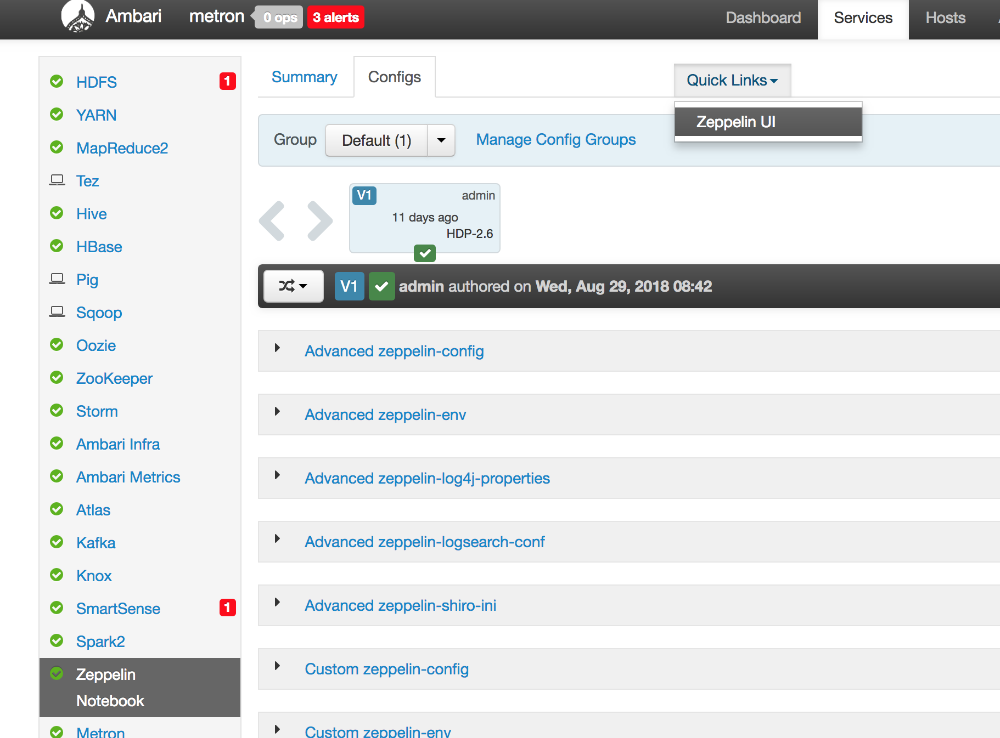
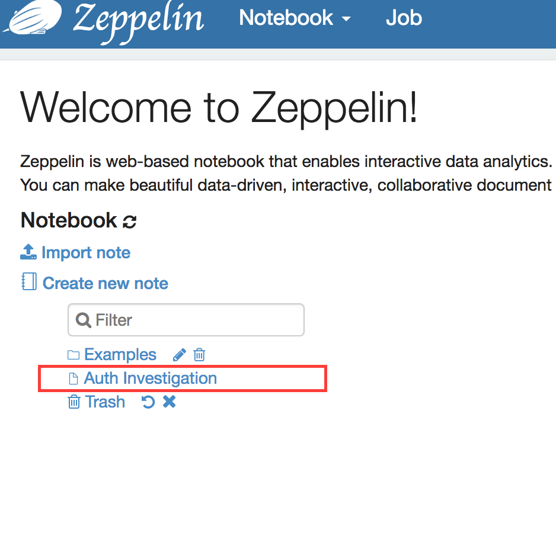
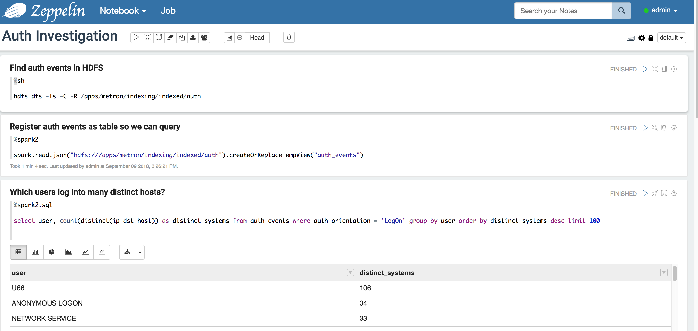
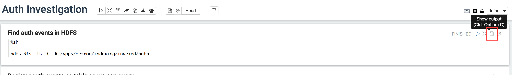
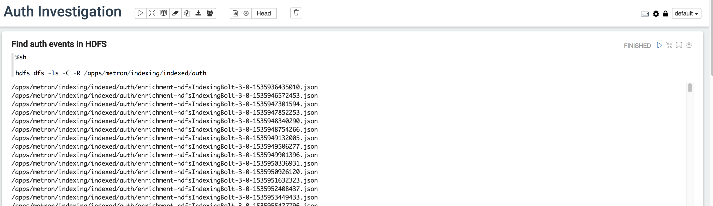
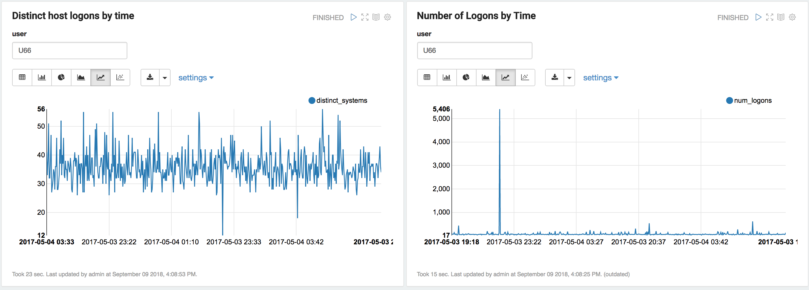
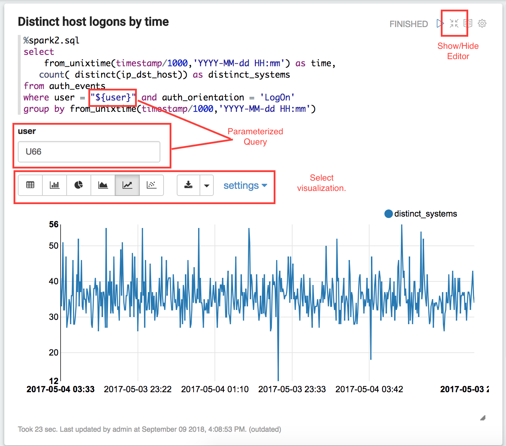
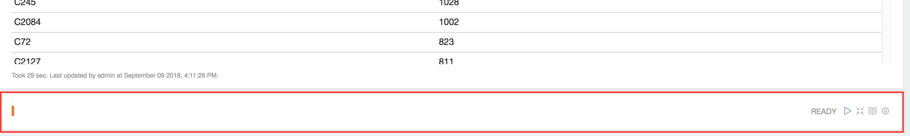

# Exploring Event History - Dashboards and Run Books for Analysis, Threat Hunting and Investigations
# Objectives
After this lab you will be able to:
1. Describe how to use the events stored in the index and HDFS to create dashboards, analytics for threat hunting, and run books for investigations. 
# Background
After an event is fully enriched and triaged, Metron automatically stores the event in an index (Solr or Elastic Search) and in HDFS.  HDFS stores the entire history of events for the specified retention period.  The index typically stores several months of the most recent events.  The retention period for each storage mechanism is configurable and there are several cost effective options for storing and analyzing years of events.  

Apache Metron and the Hadoop ecosystem offer many options for analyzing stored cybersecurity events:
1. Metron Alerts UI
2. Apache Zeppelin Notebooks using Apache Spark
3. Banana and Kibana Dashboards
4. Third party business intelligence tools 

# Metron Alerts UI
The Metron Alerts UI reads events from the index which provides a very flexible search API that quickly filters the haystack to a subset of events.  See the [Getting started](../01_GettingStarted/README.md) lab for instructions on opening the Metron Alerts UI.  Once the UI is open, enter a simple or complex query in the UI and the filtered events will display in the UI.  Click on the headers to sort ascending or descending by an event field.  Complete the earlier labs to see the Alerts UI in action.

# Apache Zeppelin and Spark 
[Apache Zeppelin](https://zeppelin.apache.org/) is an open source web based notebook for recording and sharing analytics and visualizations of event data stored in both HDFS and the index.  Zeppelin offers a number of interpeters including shell commands, Apache Spark and SQL queries.  Different interpreters can be combined in the same notebook as can python, scala and R code.   

[Apache Spark](https://spark.apache.org/) is a distributed analytics engine capable of analyzing the entire haystack and building machine learning models. Spark supports scala, python, java, and R programming languages.

Spark code included in a notebook records commands for common cyber security analytics tasks such as dashboard visualizations, investigation run books, and threat hunting queries and visualizations. 

## Exploring a Zeppelin Run Book 

1. Open Ambari in the browser:  
http://mobius.local:8080/
2. Select Zeppelin Notebook on the left hand side of the browser window.
3. Pull down the Quick Links menu to the right of the Summary and Configs tab and select Zeppelin UI.



4. The Zeppelin page appears.  Click the Login button on the upper right side of the page.


5. Enter the Zeppelin credentials (admin/admin).  Click Login. 


6. The Welcome to Zeppelin page opens.  Click on the Auth Investigation notebook link.



7. The Auth Investigation notebook opens.   The Auth Investigation notebook is an example of a run book to assist a SOC analyst when investigating an authentication alert.   A notebook consists of a set of paragraphs.   Each paragraph starts with a % followed by an interpreter name.   For example the first paragraph uses the shell interpreter.  The second paragraph uses the spark2 interpreter.  The third paragraph uses the spark2.sql interpreter.  Following the interpreter is some commands or code in the language required by the interpreter.  



8. For better readability, Zeppelin paragraphs can show or hide both the commands and command output.  The first paragraph lists the auth events files stored in HDFS.  The output is hidden.  Click on the Show output icon to the right of the "Find auth events in HDFS paragraph".  



9. Metron groups events together and writes the fully enriched and triaged events to HDFS files in the directory /apps/metron/indexing/indexed/<sensor name>.  The hdfs dfs -ls shell command lists the auth events stored in HDFS.   



10. A quick way to explore the events is to load them into a Spark dataframe, create a temporary table, and use SQL to access the events in the table.  The spark.read.json function reads all the json auth event files in the /apps/metron/indexing/indexed/auth HDFS directory and loads them into a DataFrame.  The createOrReplaceTempView function creates a temporary Spark SQL table called auth_events.  Once the table is created, we can query the auth events using SQL.

Click the Run button to the right of the "Register auth events as table so we can query" paragraph to reload the temporary table.  

In the spark2.sql "Which users log into many distinct hosts?" paragraph, Zeppelin sends the query over the auth_events temporary table to Spark and displays the results in a table. 


11. Zeppelin supports other query result visualizations including bar charts, pie charts, line charts, area charts, line charts and scatter charts.   Scroll down to the two line charts "Distinct host logons by time" and "Number of Logons by Time".  



12. Click on the Show editor button on the upper right of the "Distinct host logons by time" paragraph to show the SQL that produced the points in the line graph below.   The value of the user in the where clause is parameterized.  Zeppelin replaces ${user} in the query with the value entered in the user field text entry (U66).  Parameterized queries are helpful in run books or for threat hunting when you want to use the same visualization for different entities.  

To change the visualization, click on the tool bar below the user text entry field.



13. Scroll through the visualizations in the rest of the notebook.  Go to the bottom of the notebook.  You will see an empty new paragraph.  

  

14.  Enter the commands below and click Run.  The number of events stored in HDFS should display in a table below.   

```
%spark2.sql
select count(*) from auth_events
```

If you see the error below, scroll back up to the top of the notebook and click the run button on the "Register auth events as table so we can query paragraph".  Then run the query again:

```
Table or view not found: auth_events; line 1 pos 21
set zeppelin.spark.sql.stacktrace = true to see full stacktrace
```

  

15. Notebooks automate many common analytics tasks.  Once the data is loaded into a Spark DataFrame, you can perform common queries for threat hunting or other explorations.  The data loaded into a dataframe can also be used for training machine learning models.

## Using a Business Intelligence Tool  

Many business intelligence tools include connectors to Solr, Elastic Search and Spark SQL.  For example, the [ZoomData](https://www.zoomdata.com/) is convenient for creating visualizations and dashboards from Metron events with no programming.   

  

