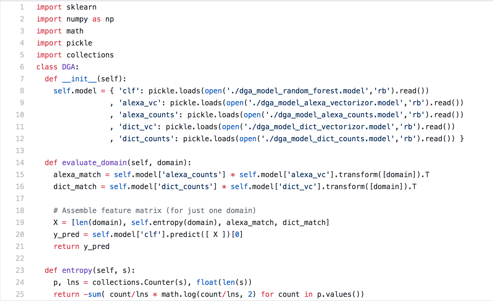
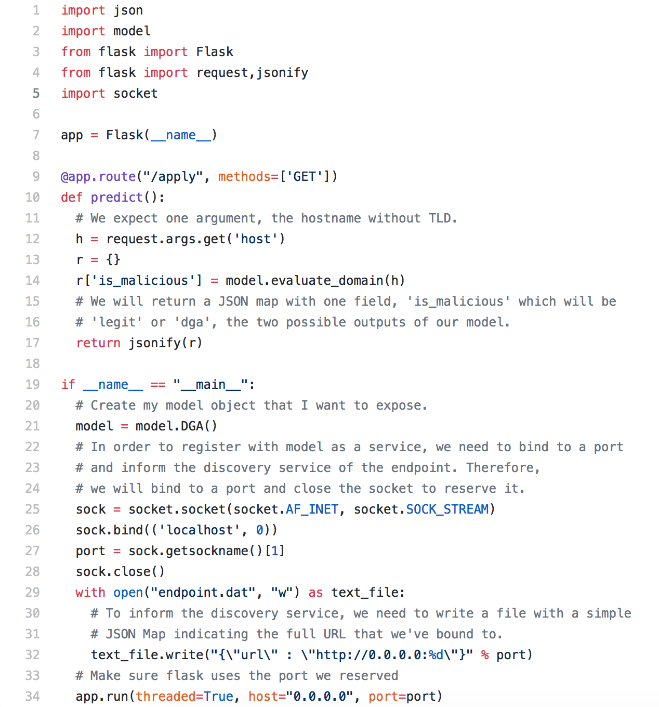
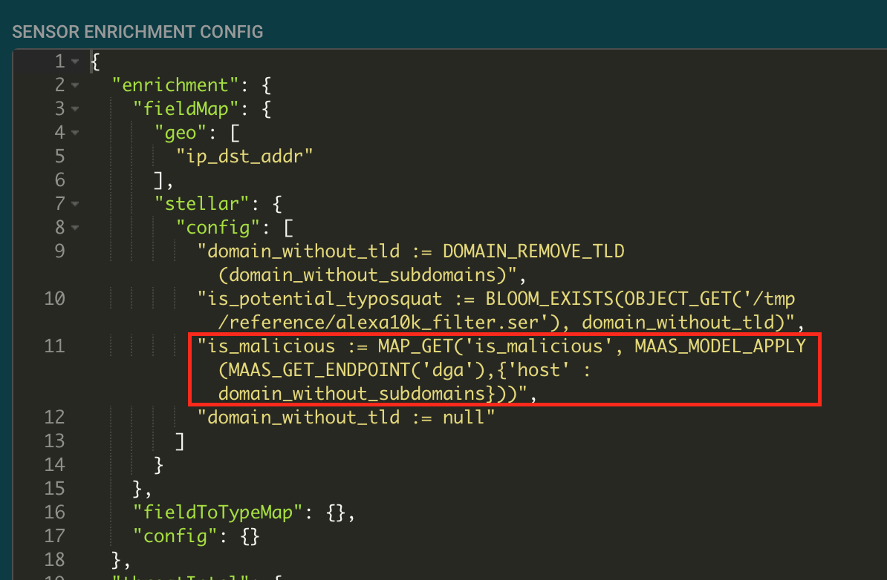
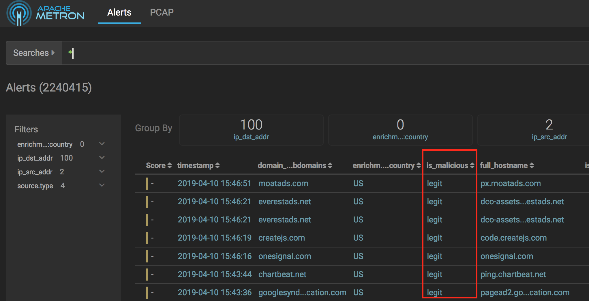
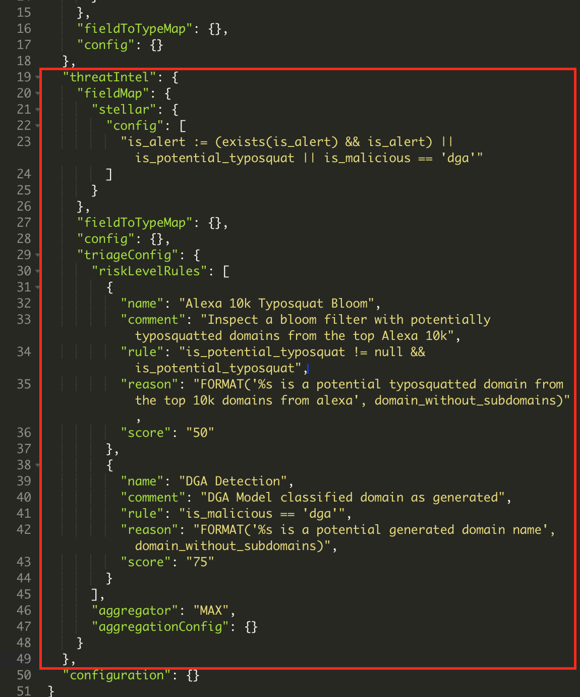
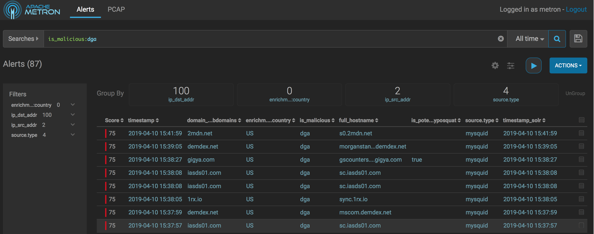
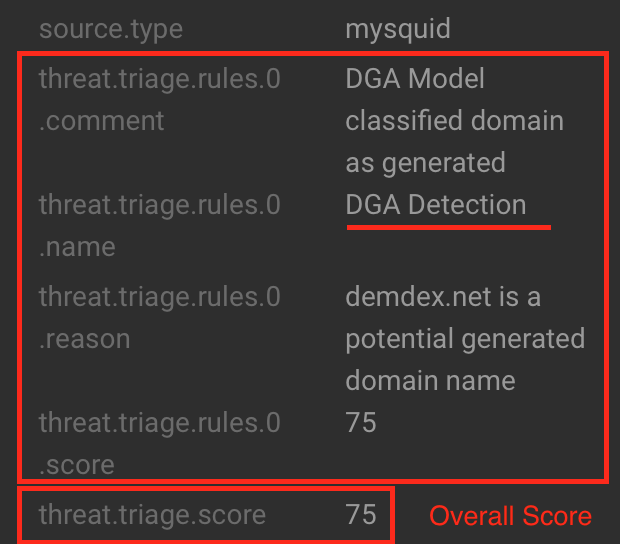
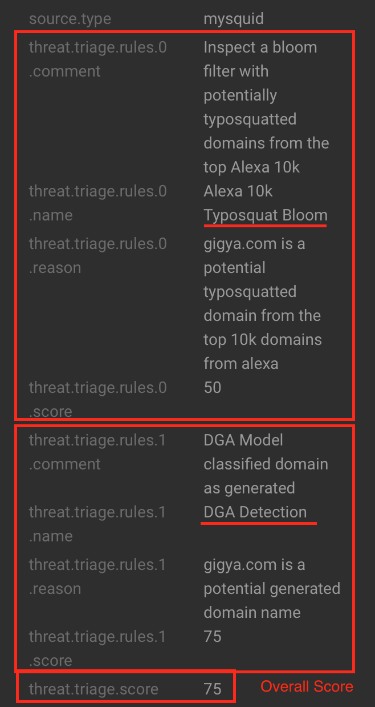

# Applying DGA Detection Machine Learning Predictions to Squid logs
## Objectives
After this lab you will be able to:
 1. Enrich an event with the predictions from a machine learning model. 
## Overview 
Machine learning models are algorithms that return a prediction or classification given a set of inputs.  Machine learning models can be obtained from open source or a third party or developed by data scientists using your Metron prepared data to train the model.   To use a machine learning model predition or classification as an enrichment:

1. Implement a rest service that follows the Metron Model as a Service interface API conventions. 
2. Register the model with Metron Model as a Service.
3. Add an enrichment equal to the model result given a set of input fields from the event.  
4. Use the model results in triaging.

This lab uses an example from [Brian Wylie's](https://www.linkedin.com/in/briford/) BSides DFW 2013 conference presentation [Data Hacking Mad Scientist Style](http://www.securitybsides.com/w/page/68749447/BSidesDFW%202013%20Full%20Track%202%20Abstracts).  The [DGA detection model](https://github.com/SuperCowPowers/data_hacking/tree/master/dga_detection) accepts a top level domain name and returns a legitimate or dga classification of the domain.  To learn more about the model training model was developed, check out the [notebook](https://nbviewer.jupyter.org/github/SuperCowPowers/data_hacking/blob/master/dga_detection/DGA_Domain_Detection.ipynb). 

## Creating a Model Rest Service
The [model python implementation](https://github.com/carolynduby/ApacheMetronWorkshop/tree/master/08_DGADetectionModelAsService/dga_model) consists of two main components: [model.py](https://github.com/carolynduby/ApacheMetronWorkshop/blob/master/08_DGADetectionModelAsService/dga_model/model.py) and [rest.py](https://github.com/carolynduby/ApacheMetronWorkshop/blob/master/08_DGADetectionModelAsService/dga_model/rest.py).  

The __init__ function in model.py (line 7) loads the model definitions, a machine learning model algorithm type and its mathematical parameters.  The __evalute_domain__ function (line 14) accepts a domain name, passes the domain name into the model, and returns a legit or dga classifcation returned by the model.   



The rest module uses the python Flask library to start a REST service endpoint.  The rest service calls the model evaluate_domain method (line 14) and returns the is_malicious DGA classification in JSON format (line 17).



## Deploying DGA Detection Model for use with Metron
1. Ssh into the mobius.local.localdomain host as the centos user using the .pem key file provided.

```
ssh -i <your key file>.pem centos@mobius.local.localdomain
```

2. Run the start_dga_model script.  The script runs the maas_service command to start the model as a service discovery service.  Then it calls maas_deploy to start a new dga detection model rest service and register the model with the name dga and version 1.0.

```
[centos@mobius ~]$ cat start_dga_model.sh 
sudo /usr/hcp/current/metron/bin/maas_service.sh -zq localhost:2181 
sudo /usr/hcp/current/metron/bin/maas_deploy.sh -hmp /user/root/models -mo ADD -m 750 -n dga -v 1.0 -ni 1 -zq localhost:2181 -lmp /root/dga_model
[centos@mobius ~]$ 
[centos@mobius ~]$ ./start_dga_model.sh 
19/04/09 23:48:34 INFO service.Client: Initializing Client
19/04/09 23:48:34 INFO service.Client: Running Client
19/04/09 23:48:34 INFO client.RMProxy: Connecting to ResourceManager at mobius.local.localdomain/127.0.0.1:8050
19/04/09 23:48:35 INFO client.AHSProxy: Connecting to Application History server at mobius.local.localdomain/127.0.0.1:10200
....
```

3. Model as a service deploys the rest service and registers a URL endpoint.  You can find information about the DGA model service host and url by using the MAAS_GET_ENDPOINT stellar function:

```
[centos@mobius ~]$ /usr/hcp/current/metron/bin/stellar -z localhost:2181
....
[Stellar]>>> MAAS_
MAAS_GET_ENDPOINT(  MAAS_MODEL_APPLY(  
[Stellar]>>> MAAS_GET_ENDPOINT( 'dga')
{name=dga, endpoint:apply=apply, version=1.0, url=http://mobius.local.localdomain:33731}
[Stellar]>>> quit
``` 

4. Copy the URL returned by MAAS_GET_ENDPOINT and test the rest endpoint using curl.  For example, in the previous step, the url for the DGA rest model endpoint is http://mobius.local.localdomain:33731.

```
## the domain google is classified as legitimate
[centos@mobius ~]$ curl http://mobius.local.localdomain:YOUR_PORT_HERE/apply?host=google
{"is_malicious":"legit"}

## the domain zaze is classified as dga 
[centos@mobius ~]$ curl http://mobius.local.localdomain:YOUR_PORT_HERE/apply?host=zaze
{"is_malicious":"dga"}
```
5. Open the Metron Configuration UI. (http://mobius.local.localdomain:4200) 

6. Click on the pencil icon to edit the mysquid sensor configuration.   Click Raw JSON in the Advanced section to modify the mysquid configuration.

7. Add the is_malicious enrichment after the is_potential typosquat enrichment.   Set is_malicious as follows:

“is_malicious := MAP_GET('is_malicious', MAAS_MODEL_APPLY(MAAS_GET_ENDPOINT('dga'), {'host' : domain_without_subdomains}))”



8. Click Save below the json.

9. Click Save under the sensor configuration.

10. Configure your browser to use the proxy on the mobius.local.localdomain host port 3128.  Browse to some web sites.  Open the Metron UI and look at the latest events.  Events have a new is_malicious field set to either legit or dga.



11. Open the mysquid sensor configuration and select Raw JSON in the Advanced section to modify the mysquid configuration.

12. In the Sensor Enrichment Config replace the threatIntel section with the text below.  The configuration adds another triage rule which sets the event score to 75 if the is_malicious field equals dga.   Note that events with that trigger both a typosquat and a dga alert will be scored at the maximum of the two scores because the aggregator is MAX.    

```
"threatIntel": {
		"fieldMap": {
			"stellar": {
				"config": [
					"is_alert := (exists(is_alert) && is_alert) || is_potential_typosquat || is_malicious == 'dga'"
				]
			}
		},
		"fieldToTypeMap": {},
		"config": {},
		"triageConfig": {
			"riskLevelRules": [
				{
					"name": "Alexa 10k Typosquat Bloom",
					"comment": "Inspect a bloom filter with potentially typosquatted domains from the top Alexa 10k",
					"rule": "is_potential_typosquat != null && is_potential_typosquat",
					"reason": "FORMAT('%s is a potential typosquatted domain from the top 10k domains from alexa', domain_without_subdomains)",
					"score": "50"
				},
				{
					"name": "DGA Detection",
					"comment": "DGA Model classified domain as generated",
					"rule": "is_malicious == 'dga'",
					"reason": "FORMAT('%s is a potential generated domain name', domain_without_subdomains)",
					"score": "75"
				}
			],
			"aggregator": "MAX",
			"aggregationConfig": {}
		}
	},
```



13. Click Save below the json.

14. Click Save under the sensor configuration.

15. Configure your browser to use the proxy on the mobiu.local.localdomain host port 3128.  Browse to gigya.com and other sites such as a news site.  Eventually you should see some alerts with a red score of 75.  Enter is_malicious:dga in the search field and click the search button.  The UI displays only dga alerts.



For alerts with is_malicious equal to dga and is_potential_typosquat equal to false, the alert will only have one score from the dga detection:



Alerts with is_malicious equal to dga and is_potential_typosquat equal to true have two scores - one score from the typosquat and a second score from dga detection.  The overall score is the maximum of the two scores because the aggregator is set to MAX:



16.  Excellent work!  You applied an off the shelf machine learning model classification to squid events and used the classification in scoring. 

# Next Lab

[Exploring Event History - Dashboards and Run Books for Analysis, Threat Hunting and Investigations](../07_ExploringEventHistory/README.md)


## References 
[Domain Generation Algorithm](https://en.wikipedia.org/wiki/Domain_generation_algorithm)

[Model as Service: Modern Streaming Data Science with Apache Metron](https://hortonworks.com/blog/model-service-modern-streaming-data-science-apache-metron/)
