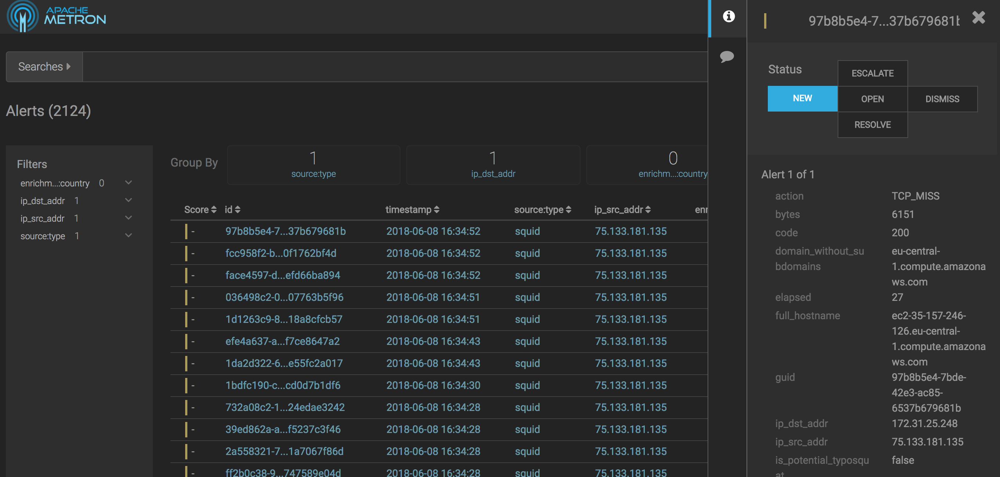
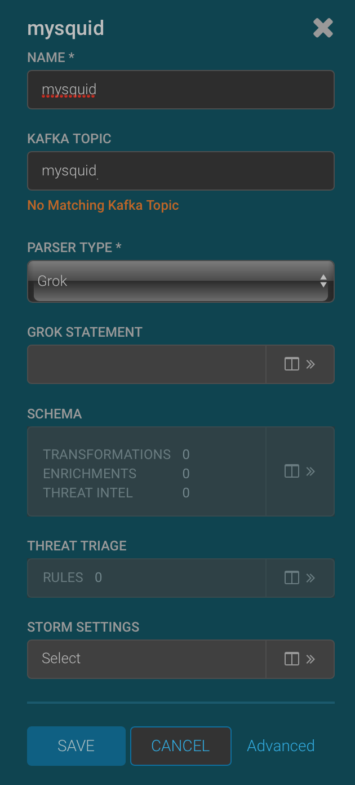
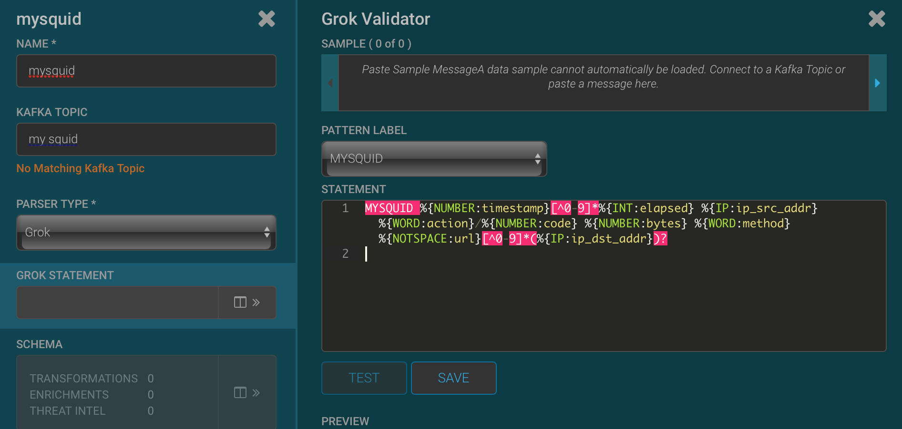
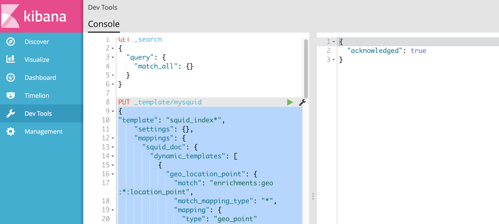
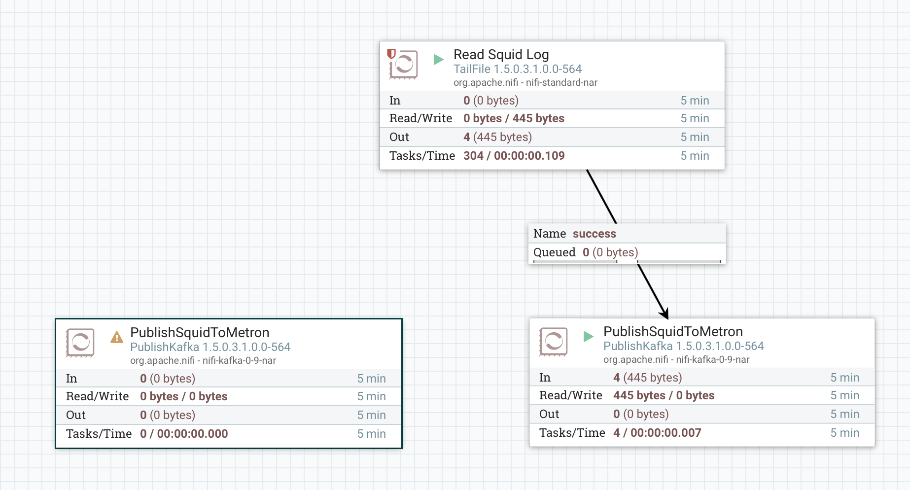
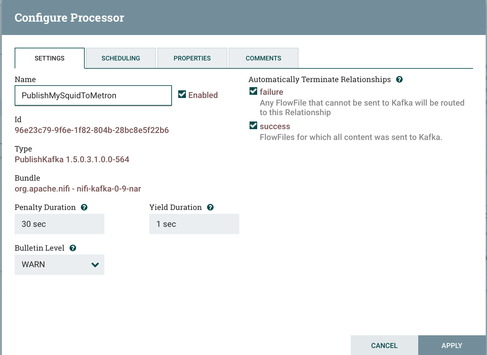
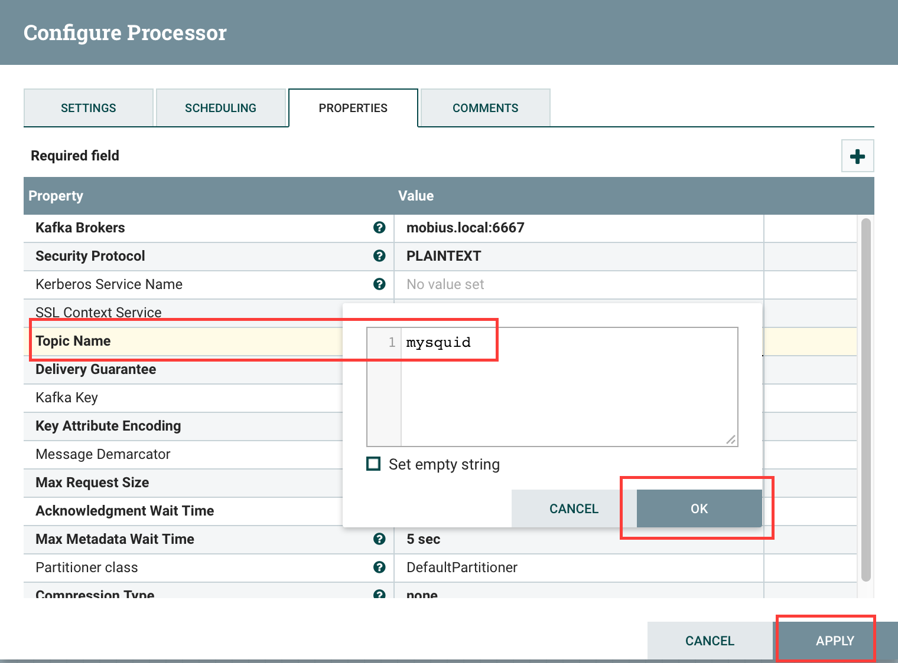
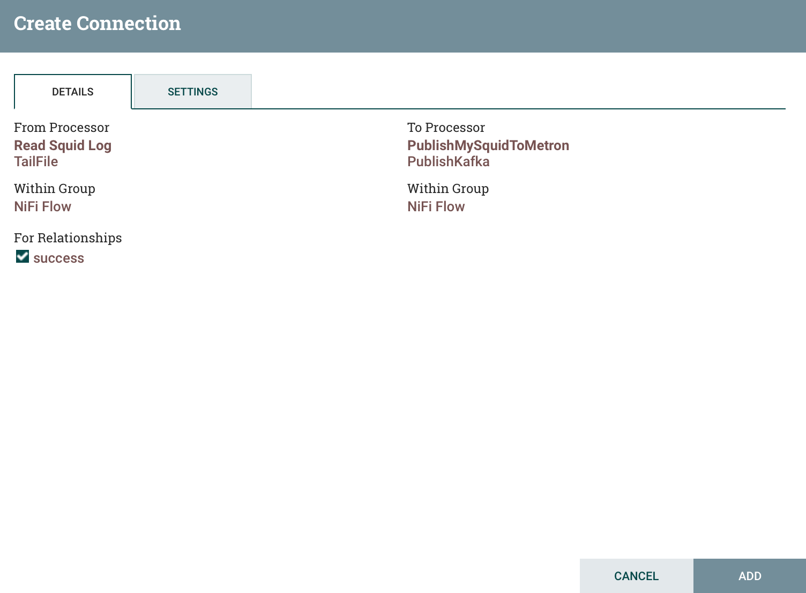
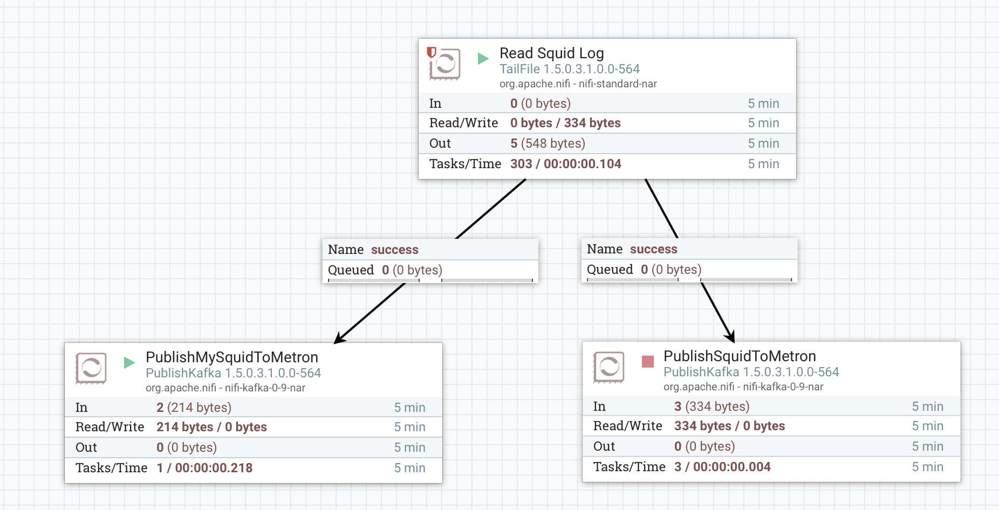

# Parsing Squid logs
## Objectives
After this lab you will be able to:
 1. Collect a squid proxy log and move it to Kafka using Nifi.
 2. Create a Metron squid parser.
 3. Add some simple transformations to the events.
 4. View the parsed logs in the Metron Alerts UI.
## Generate Squid Access Events
1. Your Metron host comes with a squid proxy installed.   Configure your proxy settings to use your squid proxy.  If you are not able to change your proxy settings, skip this step and use curl commands to generate traffic.  

The easiest way to control your proxy from Chrome is to install and extension such as Proxy SwitchySharp.  An extension enables you to select a menu item in Chrome to switch between your regular settings and your Metron proxy easily.   

On Mac open Chrome and select Chrome > Preferences from the main menu.  Scroll to the bottom of the settings page and click the Show advanced settings link.  Locate the Network section and click the Change proxy settings button.   Check Web Proxy (HTTP) and enter your Metron host name and the squid port 3128.  Check Secure Web Proxy (HTTPS) and enter your Metron name and the squid port 3128.  Click the OK button and then the Apply button to save your changes. 

On Windows, follow the manual instructions on [this page](http://www.dummies.com/computers/operating-systems/windows-10/how-to-set-up-a-proxy-in-windows-10/)


2. In the browser configured with the Metron squid proxy, open a web site that generates web requests such as google.com or a news website.  

To generate data using curl, open a command line tool and enter:
```
curl -l --proxy *metron_host_name*:3128 *web_url*
```
 
For example to access google using a proxy, 
```
curl -I --proxy ec2-35-157-246-126.eu-central-1.compute.amazonaws.com:3128 http://google.com
```

4. Open the Metron alerts ui by entering http://***metron_host_name***:4201 in the browser. 

By default you will see the most recent events at the top of the UI.  At this point you should see some squid events with recent timestamps in the alerts ui.


If you click in the space between the columns, the full details of the event will open on the right side of the browser.


## Adding the  mysquid sensor
Now we will build a mysquid sensor from scratch using a grok parser. 
1. Open the Metron Management UI.
2. Click on the + button on the lower right corner to add a new sensor.
3. Enter the following:
	Name: mysquid
	Kafka Topic: mysquid
	Parser Type: Grok



4. Click to expand the Grok Statement.   Copy and paste the grok expression below to the right of the MYSQUID grok expression name:

```
%{NUMBER:timestamp}[^0-9]*%{INT:elapsed} %{IP:ip_src_addr} %{WORD:action}/%{NUMBER:code} %{NUMBER:bytes} %{WORD:method} %{NOTSPACE:url}[^0-9]*(%{IP:ip_dst_addr})?
```



5. Paste the sample squid raw log entry into the sample and click Test.  The Preview section will update with the fields parsed from the raw log.


6. Click Save.
7. Click Save on the mysquid sensor.
## Installing the mysquid index template
After events are enriched and triaged, metron stores the events in an index.  The index template specifies how to interpret the metron events and how to index strings using either a keyword or full text search.
1. Enter the Kibana url in the browser:
http://***metron_host_name***:5000
2. Select Dev Tools from the left hand side of the kibana page.  The Dev Tools console is an easy way to interact with the index REST api.  If the Welcome window appears, click the Get to work button.

4. Paste the following command into the left side of Dev Tools window:

```
PUT _template/mysquid 
{
    "template": "mysquid_index*",
    "settings": {},
    "mappings": {
      "mysquid_doc": {
        "dynamic_templates": [
          {
            "geo_location_point": {
              "match": "enrichments:geo:*:location_point",
              "match_mapping_type": "*",
              "mapping": {
                "type": "geo_point"
              }
            }
          },
          {
            "geo_country": {
              "match": "enrichments:geo:*:country",
              "match_mapping_type": "*",
              "mapping": {
                "type": "keyword"
              }
            }
          },
          {
            "geo_city": {
              "match": "enrichments:geo:*:city",
              "match_mapping_type": "*",
              "mapping": {
                "type": "keyword"
              }
            }
          },
          {
            "geo_location_id": {
              "match": "enrichments:geo:*:locID",
              "match_mapping_type": "*",
              "mapping": {
                "type": "keyword"
              }
            }
          },
          {
            "geo_dma_code": {
              "match": "enrichments:geo:*:dmaCode",
              "match_mapping_type": "*",
              "mapping": {
                "type": "keyword"
              }
            }
          },
          {
            "geo_postal_code": {
              "match": "enrichments:geo:*:postalCode",
              "match_mapping_type": "*",
              "mapping": {
                "type": "keyword"
              }
            }
          },
          {
            "geo_latitude": {
              "match": "enrichments:geo:*:latitude",
              "match_mapping_type": "*",
              "mapping": {
                "type": "float"
              }
            }
          },
          {
            "geo_longitude": {
              "match": "enrichments:geo:*:longitude",
              "match_mapping_type": "*",
              "mapping": {
                "type": "float"
              }
            }
          },
          {
            "timestamps": {
              "match": "*:ts",
              "match_mapping_type": "*",
              "mapping": {
                "type": "date",
                "format": "epoch_millis"
              }
            }
          },
          {
            "threat_triage_score": {
              "mapping": {
                "type": "float"
              },
              "match": "threat:triage:*score",
              "match_mapping_type": "*"
            }
          },
          {
            "threat_triage_reason": {
              "mapping": {
                "type": "text",
                "fielddata": "true"
              },
              "match": "threat:triage:rules:*:reason",
              "match_mapping_type": "*"
            }
          }
        ],
        "properties": {
          "action": {
            "type": "keyword"
          },
          "bytes": {
            "type": "long"
          },
          "code": {
            "type": "long"
          },
          "domain_without_subdomains": {
            "type": "keyword"
          },
          "elapsed": {
            "type": "long"
          },
          "full_hostname": {
            "type": "keyword"
          },
          "guid": {
            "type": "keyword"
          },
          "ip_dst_addr": {
            "type": "ip"
          },
          "ip_src_addr": {
            "type": "ip"
          },
          "is_alert": {
            "type": "keyword"
          },
          "is_potential_typosquat": {
            "type": "boolean"
          },
          "method": {
            "type": "keyword"
          },
          "original_text": {
            "type": "text"
          },
          "source:type": {
            "type": "keyword"
          },
          "timestamp": {
            "type": "date",
            "format": "epoch_millis"
          },
          "url": {
            "type": "keyword"
          },
          "alert": {
            "type": "nested"
          }
        }
      }
    }
  }
```

5. Press the green play button.   The result on the right hand side of the screen will show "acknowledged" : true
## Starting the mysquid sensor
1. Return to the Metron Management UI.
2. Push the play button on the mysquid sensor to start the parser.
## Moving squid access.log lines to Kafka for processing by Metron
1. Enter the Nifi URL in your browser:
 http://***metron_host_name***:9090/nifi/
 10. The Nifi flow on the canvas tails the squid access.log and sends the lines to the PublishKafka.  PublishKafka breaks the log sample into individual lines and writes each line as a Kafka message to the squid topic.

 11. Right click on the PublishSquidToMetron processor and select Copy.
 12. Right click on an empty area of the canvas and select Paste.  

 13. Right click on the copy of PublishSquidToMetron and select Configure.
 14. Click on the Settings tab and change the name to PublishMySquidToMetron.

 15. Click the Properties tab and change Topic Name to mysquid.

 16. Click Apply to save the changes.
 17. Hover the cursor over the Read Squid Log processor until the connect icon appears.   Click and drag the flow to the middle of the PublishMySquidToMetron.  Drop the cursor and the Create Connection dialog appears.

 18. Click Add.
 19. The flow should look as below:


2.  The flow can now write squid data to both topics or either topic.  It will be easier to see what is happening if we stop writing to the squid topic.   
3. Right click on PublishSquidToMetron and select Stop.
4. Right click on PublishMySquidToMetron and select Start.


5. Squid events should now be flowing to the mysquid sensor.
6. Set the browser to use the Metron proxy to try out the mysquid parser.
7. Open Metron Alerts UI.  The Metron Alerts UI will now show mysquid events.

